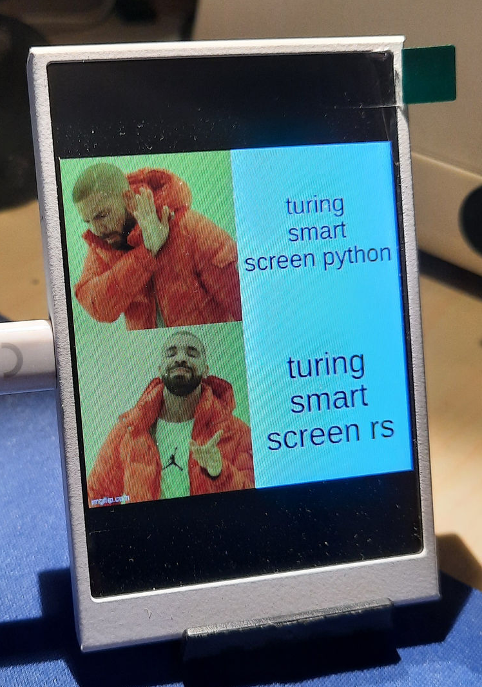

# Turing-Smart-Screen-RS

This is a Rust driver for the Turing Smart Screen. It is based on [turing-smart-screen-python](https://github.com/mathoudebine/turing-smart-screen-python) but is not a direct port. It is a rewrite in Rust.


## Usage

Use the `image` library to load an image or to create an image from scratch. Then use the `Screen` struct to draw the image on the screen and to control the screen.

```rust
let port = Screen::find_port().expect("No port found");
let mut screen = Screen::new(port).expect("Failed to open port");

screen.orientation(Orientation::Portrait).expect("Failed to set orientation");
screen.clear().expect("Failed to clear screen");

let img = image::ImageReader::open("meme.png").unwrap().decode().unwrap();
screen.draw(img.into()).expect("Failed to draw image");
```

There are more functions available in the `Screen` struct. Check the documentation for more information.

## It works!

